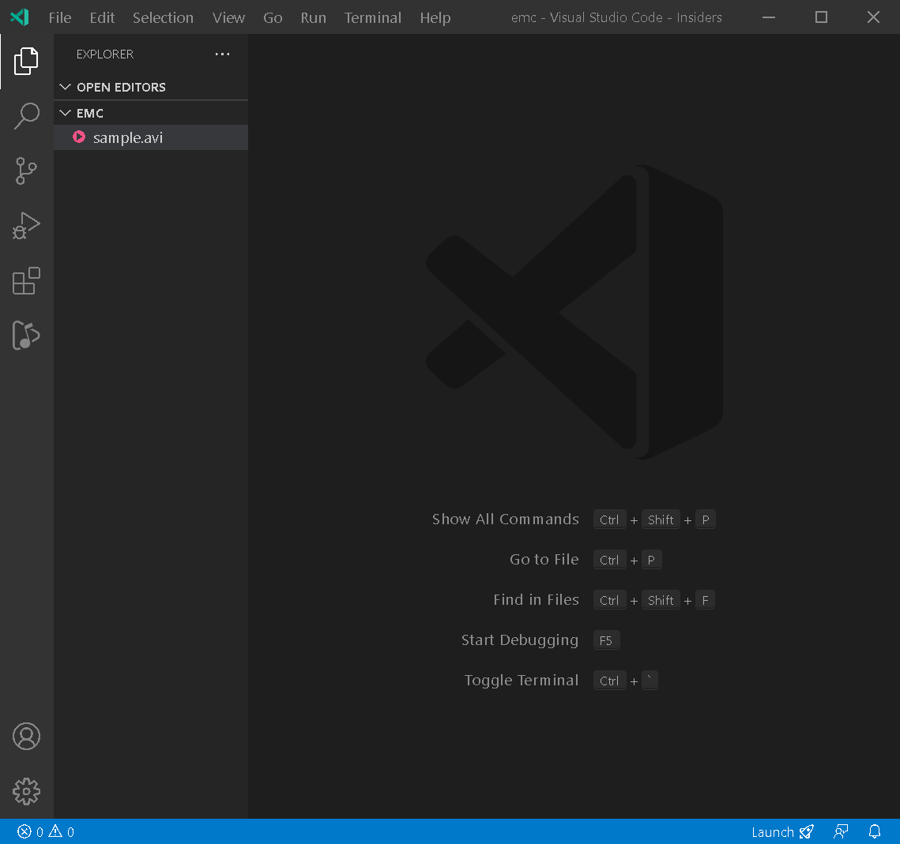

# Easy Media Converter
Have you ever wondered 🤔 could VS Code become a media converter for some reason?\
Or ever stump upon the need to convert quickly a media file for your game development?\
The answer is **YES❗**

This is the extension that could help you with that job, and right inside the VS Code. How 😎🆒🧊!\
It converts supported media files to mp3/mp4 format here and there 🎉.

## Features
- Supported audio formats: `wav | wma`
- Supported video formats: `avi | wmv | flv | mkv`
## Known Issues
- Best to keep the media file under 3MB for converting.
- Due to file properties lost that's in transfer process method for bigger file, *ffmpeg* may not able to convert it.

## Release Notes
### 0.0.1
- Initial release of Easy Media Converter

**Enjoy!**
